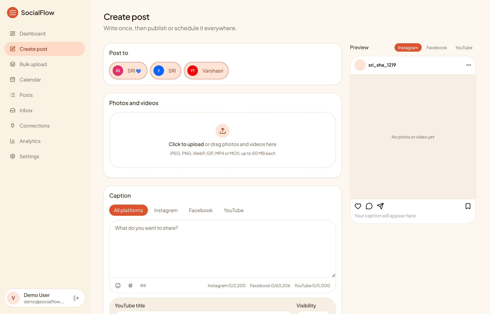
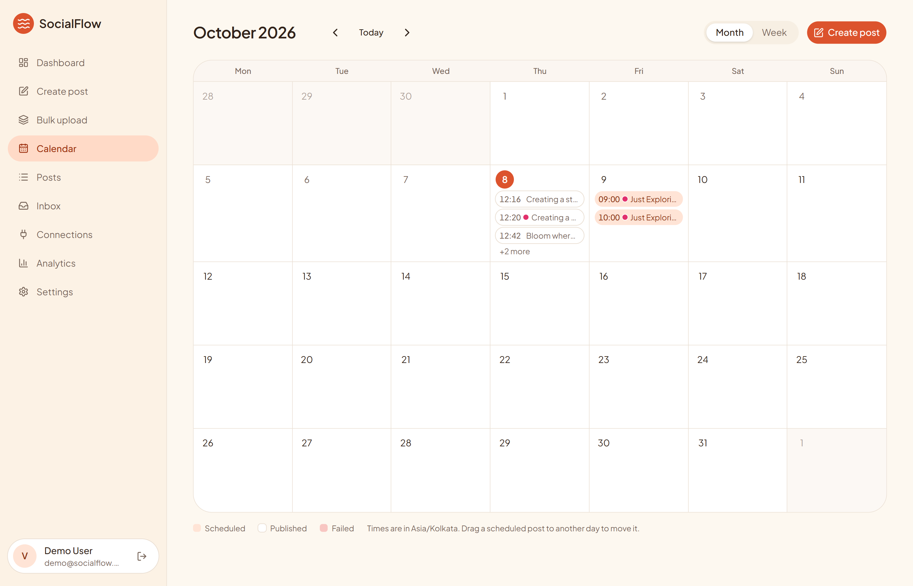
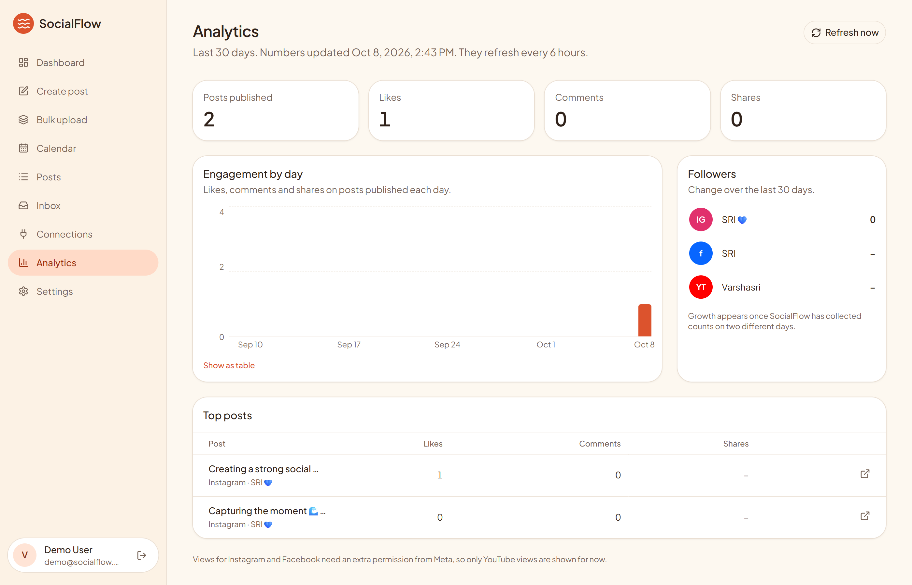
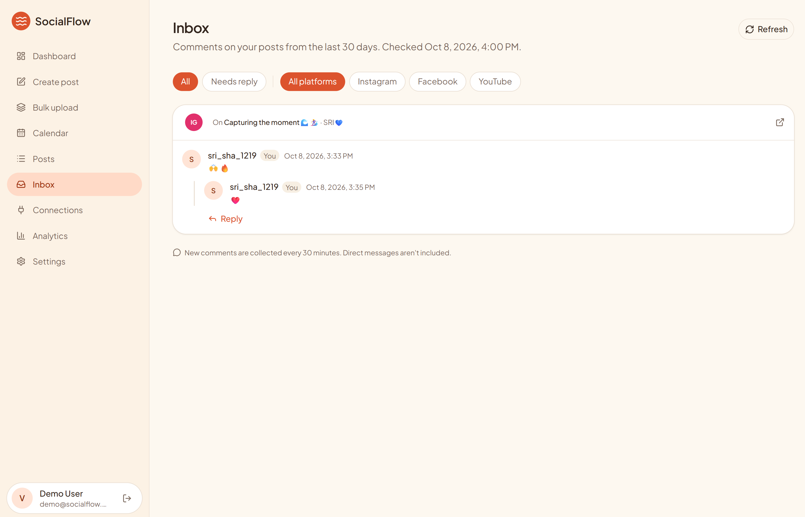
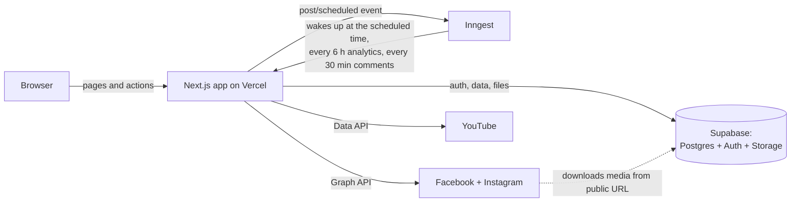

# SocialFlow

**Write once. Post everywhere.** SocialFlow is a full-stack web app for creating, scheduling and publishing posts to **Instagram, Facebook and YouTube** from one dashboard, with analytics and a unified comments inbox.

**Live demo:** https://socialflow-uhru.vercel.app

> A learning and portfolio project, built step by step from research to deployment.

<!-- Add screenshots to docs/screenshots/ with these names and they'll show here. -->
| Create post | Calendar |
|---|---|
|  |  |
| **Analytics** | **Inbox** |
|  |  |

## Features

| Feature | What it does |
|---|---|
| **Accounts** | Email/password and Google login, password reset, profile with time zone |
| **Connections** | Connect Facebook Pages, Instagram Business/Creator accounts and YouTube channels with OAuth. Tokens are encrypted (AES-256-GCM) and never sent to the browser |
| **Create post** | Upload photos and videos, write one caption or a different caption per platform, emoji, hashtag and link helpers, live previews, and per-platform checks (e.g. Instagram aspect ratios, "YouTube needs one video") |
| **Publish now** | Sends to every chosen account in parallel: Facebook (text, photo, album, video), Instagram (photo, carousel, Reel), YouTube (resumable upload). Per-account results with retry |
| **Scheduling** | Pick a date and time in your own time zone. Background jobs publish at that moment, and cancelling or rescheduling is handled safely |
| **Calendar** | Month and week views. Drag a scheduled post to another day to move it |
| **Bulk upload** | Turn up to 30 files into separate posts, spaced every N hours or days |
| **Analytics** | Likes, comments, shares, YouTube views and follower growth, collected every 6 hours |
| **Inbox** | Comments from all three platforms in one place, with replies sent as your Page, account or channel |

## How it works



- **Next.js 16 (App Router)** renders pages on the server and uses **Server Actions** and route handlers for everything that changes data.
- **Supabase** holds users, posts and media. **Row Level Security** limits every table to its owner. Platform tokens live in a separate table with no browser access, encrypted with a key that only the server has.
- **Inngest** runs background jobs: each scheduled post sleeps until its time (in chunks of up to 6 days), then checks it wasn't cancelled before publishing. Cron jobs collect analytics and comments.
- **Publishing** claims a post with a single conditional update (`draft → publishing`), so double-clicks or duplicate jobs can't publish twice.

## Tech stack

Next.js 16 · React 19 · TypeScript · Tailwind CSS 4 · shadcn/ui · Supabase · Inngest · Vercel · Facebook Graph API · YouTube Data API v3

## Project structure

```
src/
  app/
    (app)/          Logged-in pages: dashboard, create, bulk, calendar, posts, inbox, analytics, connections, settings
    (auth)/         Log in, sign up, forgot and reset password
    api/connect/    OAuth start and callback for Meta and YouTube
    api/posts/      "Publish now" endpoint
    api/inngest/    Background jobs endpoint
    privacy/ terms/ Legal pages (required by Google and Meta)
  components/       UI pieces: composer, calendar, sidebar, …
  inngest/          Background jobs: scheduled publishing, analytics, comments
  lib/
    connectors/     Connecting accounts (OAuth) for Meta and YouTube
    publishing/     Publishing to each platform, token refresh, errors
    analytics/      Collecting metrics
    inbox/          Collecting comments and sending replies
    supabase/       Database clients (browser, server, admin)
  proxy.ts          Keeps the session fresh and protects pages
supabase/migrations/  Database setup, run in order
```

## Running it yourself

1. Install [Node.js](https://nodejs.org) (LTS).
2. Create a [Supabase](https://supabase.com) project and run each file in `supabase/migrations/` **in order** in its SQL Editor.
3. Copy `.env.example` to `.env.local` and fill it in:

   | Variable | Where to get it |
   |---|---|
   | `NEXT_PUBLIC_SUPABASE_URL`, `NEXT_PUBLIC_SUPABASE_PUBLISHABLE_KEY` | Supabase → Project Settings → API Keys |
   | `SUPABASE_SECRET_KEY` | Supabase → API Keys → Secret keys (server only) |
   | `TOKEN_ENCRYPTION_KEY` | `node -e "console.log(require('crypto').randomBytes(32).toString('base64'))"` |
   | `YOUTUBE_CLIENT_ID`, `YOUTUBE_CLIENT_SECRET` | Google Cloud OAuth client, with YouTube Data API v3 enabled |
   | `META_APP_ID`, `META_APP_SECRET` | Meta for Developers app (Pages and Instagram use cases) |
   | `INNGEST_DEV=1` | Local only. On Vercel, the Inngest integration adds its keys instead |

4. Add the OAuth redirect URLs: `http://localhost:3000/api/connect/youtube/callback` (Google) and `https://<your-domain>/api/connect/meta/callback` (Meta).
5. Start it: on Windows, double-click `start-dev.bat` (it also starts the Inngest Dev Server). Elsewhere:

   ```bash
   npm install
   npm run dev
   npx inngest-cli@latest dev -u http://localhost:3000/api/inngest
   ```

## Limitations

- The Google and Meta apps are in development/testing mode, so only accounts added as testers can connect. YouTube keeps uploads from unverified apps private, and testing-mode logins expire after 7 days.
- Instagram and Facebook views need an extra Meta permission, so analytics show YouTube views only.
- Direct messages aren't included in the inbox.

## What I learned

<!-- Write a few sentences in your own words: the hardest problem, how you solved it, what you'd do differently. Interviewers love this section. -->
